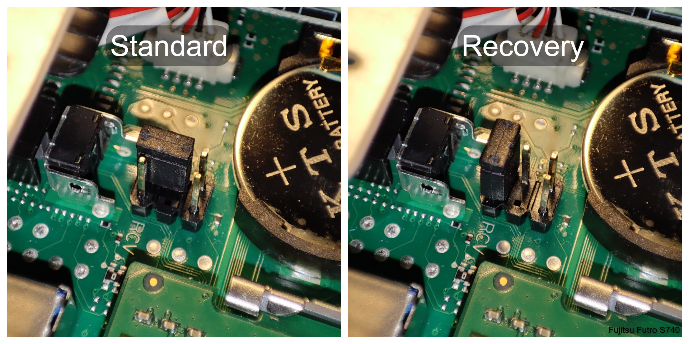

# Futro S740 - Guide/ Specs/ Information

\> English version [here](https://github.com/R3NE07/Futro-S740/blob/main/README_EN.md) <  

## Inhalt

[1 - Hardware](README.md#1---hardware)  
&nbsp;&nbsp;[1.1 - Overview](README.md#11---overview)  
&nbsp;&nbsp;[1.2 - Specs](README.md#12---specs)  
&nbsp;&nbsp;[1.3 - Netzteil](README.md#13---netzteil)  
&nbsp;&nbsp;[1.4 - CPU](README.md#14---cpu)  
&nbsp;&nbsp;[1.4 - PCI](README.md#14---pci)  
&nbsp;&nbsp;[1.5 - Motherboard](README.md#15---motherboard)  
&nbsp;&nbsp;[1.6 - Erweiterungen](README.md#16---erweiterungen)  
&nbsp;&nbsp;[1.7 - Festplatten / M.2 Ports](README.md#17---festplatten--m2-ports)  
&nbsp;&nbsp;[1.8 - PoE](README.md#18---poe)  
&nbsp;&nbsp;[1.9 - RAM](README.md#19---ram)  
[2 - Firmware](README.md#2---firmware)  
&nbsp;&nbsp;[2.1 - BIOS](README.md#21---bios)  
&nbsp;&nbsp;&nbsp;&nbsp;[2.1.1 - Version](README.md#211---versionen)  
&nbsp;&nbsp;&nbsp;&nbsp;[2.1.2 - BIOS Setup](README.md#212---bios-setup)  
&nbsp;&nbsp;[2.2 - BIOS Update](README.md#22---bios-update)  
&nbsp;&nbsp;[2.3 - BIOS Recovery](README.md#23---bios-recovery)  
&nbsp;&nbsp;[2.4 - Standard OS](README.md#24---standard-os)  
[3 - Windows / Linux](README.md#3---windows--linux)  
&nbsp;&nbsp;[3.1 Server Betriebssysteme](README.md#31-server-betriebssysteme)  
&nbsp;&nbsp;[3.2 Desktop Betriebssysteme](README.md#32-desktop-betriebssysteme)  
[4 - Mods](README.md#4---mods)  
[5 - Stromverbrauch](README.md#5---stromverbrauch)  
[6 - Gemeldete Probleme](README.md#6---gemeldete-probleme)  
[7 - Links](README.md#7---links)  
[8 - Bilder](README.md#8---bilder) 

## Anmerkung:

Dieser Guide ist weder offiziell, vollständig noch fehlerfrei!  
Er ist lediglich eine Zusammenstellung von Informationen und Berichten anderer Futro Besitzer.  

***

## 1 - Hardware  

### 1.1 - Overview  

Der Futro S740 ist ein Thinclient aus 2018 mit einem mSTX D3544-A Mainboard, welcher eine abgespackte Version des Kontron D3544-S2 mit dem dazugehörigen Smartcase S500 aus gleichem Hause ist.  
Anders wie ältere Thinclients wird der Futro nicht nur vorgesehen über Fernzugriff sich mit einem Server zu verbinden, auf dem dann Software ausgeführt wird, sondern hat der Futro genug Rechenleistung um als eigenständiger Mini PC zu laufen.

### 1.2 - Specs  

| Prozessor & Grafik |  |
| --- | --- |
| CPU | Intel® Celeron®-Prozessor J4105 (4x 1,5-2,5GHz; 10W TDP; 4MB Cache) |
| iGPU | Intel® UHD-Grafik 600 (max. 4096x2160 60Hz) |

| Memory |  |
| --- | --- |
| Flash | M.2 SATA 128GB / 64GB / 32GB ( / 16GB? ) |
| RAM | DDR4 2400MHz 4GB / 8GB |

| Peripherie |  |
| --- | --- |
| Ethernet | 10/100/1000 Mbit/s Realtek RTL8111G |
| WiFi | Optional: Intel Wireless-AC 9260 |
| Audio | 1x Line-Out, 1x Mikrofon, 1x Kopfhörer (Realtek ALC671) |
| USB 2.0 | 4x hinten |
| USB 3.0 | 2x vorne, Optional: 1x USB-C hinten |
| DisplayPort | 2x DP1.2a |
| Seriell (RS232) | Optional: hinten |
| Kensington-Lock | 1x hinten |

| Power |  |
| --- | --- |
| Eingang | 8V-24V, Typ. 5-15W, Max. 5A/100W |
| Stecker | 5.5x2.5 Hohlstecker (Minuspol außen) |
| Ausgeschaltet | 0,19W (WoL aus) / 1,25W (WoL an) |
| Idle | ca. 3W |
| Surfen | ca. 10W |
| Unter Last | ca. 14W |

| Maße |  |
| --- | --- |
| B x T x H | 36 x 165 x 147 mm |
| B x T x H (mit Standfuß) | 76 x 175 x 158 mm |
| Gewicht | 575g (je nach Konfiguration) |

### 1.3 - Netzteil  

Manche Geräte werden mit dem 19V/2,1A; Effizienzstufe VI (ADP-40HH), manche mit dem 20V/2,0A; Stufe V (ADP-40HP) geliefert.

### 1.4 - CPU  

Der Intel J4105 ist ein Gemini Lake SoC wie man sie auch in anderen preiswerten Mini PCs und Laptops findet.

Ausgabe aus Linux’s /proc/cpuinfo:

```
vendor_id	: GenuineIntel  
cpu family	: 6  
model		: 122  
model name	: Intel(R) Celeron(R) J4105 CPU @ 1.50GHz  
stepping	: 1  
microcode	: 0x3c  
cpu MHz      : 2014.580  
cache size	: 4096 KB  
physical id	: 0  
siblings	: 4  
core id		: 0  
cpu cores	: 4  
apicid		: 0  
initial apicid	: 0  
fpu		: yes  
fpu_exception	: yes  
cpuid level	: 24  
wp		: yes  
flags		: fpu vme de pse tsc msr pae mce cx8 apic sep mtrr pge mca cmov pat pse36 clflush dts acpi mmx fxsr sse sse2 ss ht tm pbe syscall nx pdpe1gb rdtscp lm constant_tsc art arch_perfmon pebs bts rep_good nopl xtopology nonstop_tsc cpuid aperfmperf tsc_known_freq pni pclmulqdq dtes64 monitor ds_cpl vmx est tm2 ssse3 sdbg cx16 xtpr pdcm sse4_1 sse4_2 x2apic movbe popcnt tsc_deadline_timer aes xsave rdrand lahf_lm 3dnowprefetch cpuid_fault cat_l2 pti cdp_l2 ssbd ibrs ibpb stibp ibrs_enhanced tpr_shadow vnmi flexpriority ept vpid ept_ad fsgsbase tsc_adjust smep erms mpx rdt_a rdseed smap clflushopt intel_pt sha_ni xsaveopt xsavec xgetbv1 xsaves dtherm ida arat pln pts umip rdpid md_clear arch_capabilities  
bugs		: cpu_meltdown spectre_v1 spectre_v2 spec_store_bypass  
bogomips	: 2995.20  
clflush size	: 64  
cache_alignment : 64  
address sizes	: 39 bits physical, 48 bits virtual  
power management:  
```

### 1.4 - PCI  

\- Der S740 besitzt weder PCIe noch mPCIe Stecker
\- Dafür haben die M.2 Ports PCIe Schnittstellen mit jeweils PCIe 2.0 x1 und einer Datenrate von max. 5Gbit bzw. Netto nur 500MByte/s

Ausgabe von Linux Befehl „lspci“:

```
00:00.0 Host bridge: Intel Corporation Gemini Lake Host Bridge (rev 03)
00:00.1 Signal processing controller: Intel Corporation Celeron/Pentium Silver Processor Dynamic Platform and Thermal Framework Processor Participant (rev 03)
00:00.3 System peripheral: Intel Corporation Device 3190 (rev 03)
00:02.0 VGA compatible controller: Intel Corporation UHD Graphics 605 (rev 03)
00:0f.0 Communication controller: Intel Corporation Celeron/Pentium Silver Processor Trusted Execution Engine Interface (rev 03)
00:12.0 SATA controller: Intel Corporation Device 31e3 (rev 03)
00:13.0 PCI bridge: Intel Corporation Gemini Lake PCI Express Root Port (rev f3)
00:13.2 PCI bridge: Intel Corporation Gemini Lake PCI Express Root Port (rev f3)
00:13.3 PCI bridge: Intel Corporation Gemini Lake PCI Express Root Port (rev f3)
00:14.0 PCI bridge: Intel Corporation Gemini Lake PCI Express Root Port (rev f3)
00:14.1 PCI bridge: Intel Corporation Gemini Lake PCI Express Root Port (rev f3)
00:15.0 USB controller: Intel Corporation Device 31a8 (rev 03)
00:16.0 Signal processing controller: Intel Corporation Celeron/Pentium Silver Processor Serial IO I2C Host Controller (rev 03)
00:16.1 Signal processing controller: Intel Corporation Celeron/Pentium Silver Processor Serial IO I2C Host Controller (rev 03)
00:16.2 Signal processing controller: Intel Corporation Device 31b0 (rev 03)
00:16.3 Signal processing controller: Intel Corporation Device 31b2 (rev 03)
00:17.0 Signal processing controller: Intel Corporation Device 31b4 (rev 03)
00:17.1 Signal processing controller: Intel Corporation Device 31b6 (rev 03)
00:17.2 Signal processing controller: Intel Corporation Device 31b8 (rev 03)
00:17.3 Signal processing controller: Intel Corporation Device 31ba (rev 03)
00:19.0 Signal processing controller: Intel Corporation Celeron/Pentium Silver Processor Serial IO SPI Host Controller (rev 03)
00:19.1 Signal processing controller: Intel Corporation Celeron/Pentium Silver Processor Serial IO SPI Host Controller (rev 03)
00:19.2 Signal processing controller: Intel Corporation Celeron/Pentium Silver Processor Serial IO SPI Host Controller (rev 03)
00:1f.0 ISA bridge: Intel Corporation Device 31e8 (rev 03)
00:1f.1 SMBus: Intel Corporation Celeron/Pentium Silver Processor Gaussian Mixture Model (rev 03)
02:00.0 Ethernet controller: Realtek Semiconductor Co., Ltd. RTL8111/8168/8411 PCI Express Gigabit Ethernet Controller (rev 0c)
```

### 1.5 - Motherboard  

Abgespeckte Variante des Kontron D3544-S2:  
\- bestückt: COM2 (RS232), M.2-SSD, M.2-WiFi/BT, SPDIF-Pinheader, Buzzer  
\- unbestückt: COM1 (RS232/422/485), USB 2.0 header, Fan-Header, SATA-Power, 24Bit LVDS, LVDS-Backlight, LVDS Voltage Select, USB3.0 Header, SATA1, SATA0, Intrusion-Sensor, eDP, Monospeaker-Pinheader, FP Audio Pinheader

### 1.6 - Erweiterungen  

\- USB-C Lässt sich auch ohne proprietärem Fujitsu Kabel nachrüsten ([1](https://www.mydealz.de/deals/refurbished-fujitsu-futro-s740-raspberry-pi-alternative-2041563#reply-37704282), [2](https://www.mydealz.de/deals/refurbished-fujitsu-futro-s740-raspberry-pi-alternative-2041563#reply-37610315), [3](https://www.mydealz.de/deals/refurbished-fujitsu-futro-s740-raspberry-pi-alternative-2041563#comment-37656704), [4](https://www.mydealz.de/deals/refurbished-fujitsu-futro-s740-raspberry-pi-alternative-2041563#reply-37722851), [5](https://www.mydealz.de/deals/refurbished-fujitsu-futro-s740-raspberry-pi-alternative-2041563#reply-37810617), [6](https://www.mydealz.de/deals/refurbished-fujitsu-futro-s740-raspberry-pi-alternative-2041563#comment-38001225), [7](https://www.mydealz.de/deals/refurbished-fujitsu-futro-s740-raspberry-pi-alternative-2041563#comment-38291707), [8](https://www.mydealz.de/deals/refurbished-fujitsu-futro-s740-raspberry-pi-alternative-2041563#comment-38305063)) manche Kabel erreichen evtl. nur USB 2.0 Geschwindigkeiten >480MB/s ([1](https://www.mydealz.de/deals/refurbished-fujitsu-futro-s740-raspberry-pi-alternative-2041563#reply-38046486), [2](https://www.mydealz.de/deals/refurbished-fujitsu-futro-s740-raspberry-pi-alternative-2041563#comment-38503891))
\- 2 weitere USB 3.0 Ports mit internem Header möglich ([1](https://www.mydealz.de/deals/refurbished-fujitsu-futro-s740-raspberry-pi-alternative-2041563#reply-37745987), [2](https://www.mydealz.de/deals/refurbished-fujitsu-futro-s740-raspberry-pi-alternative-2041563#reply-37760719))  
\- 1 weiterer USB 2.0 Port mit internem Header (unbestückt!) möglich  
\- Standard WiFi Karte: Intel 9260 (jede M.2 Karte sollte passen)  
\- WiFi Karte nachrüsten ([1](https://www.mydealz.de/deals/refurbished-fujitsu-futro-s740-raspberry-pi-alternative-2041563#comment-38263023), [2](https://www.mydealz.de/deals/refurbished-fujitsu-futro-s740-raspberry-pi-alternative-2041563#comment-38500729))  
\- M.2 WiFi Port soll CNVi only sein ([1](https://www.mydealz.de/deals/fujitsu-q5562-mini-pc-4gb-ram-intel-g4400t-cpu-ohne-ssd-als-raspberry-alternative-fur-smarthome-server-ebay-refurbished-2038281#reply-37455555)), non-CNVi Karten funktionieren aber auch ([1](https://www.mydealz.de/deals/refurbished-fujitsu-futro-s740-raspberry-pi-alternative-2041563#reply-37792213))  
\- Es gibt M.2 LAN-Karten die bis zu 2 weitere LAN-Buchsen hergeben ([1](https://www.mydealz.de/deals/refurbished-fujitsu-futro-s740-raspberry-pi-alternative-2041563#comment-37760460), [2](https://www.mydealz.de/deals/refurbished-fujitsu-futro-s740-raspberry-pi-alternative-2041563#comment-37791852), [3](https://www.mydealz.de/deals/refurbished-fujitsu-futro-s740-raspberry-pi-alternative-2041563#reply-37793620), [4](https://www.mydealz.de/deals/refurbished-fujitsu-futro-s740-raspberry-pi-alternative-2041563#reply-37993085))  
  \- eine Firewall/AdBlocker lässt sich statt mit einem 2. LAN Port auch mit VLAN umsetzen  
\- Mit PD Dummy kann eine Powerbank als Stromversorgung & USV eingesetzt werden ([1](https://www.mydealz.de/deals/refurbished-fujitsu-futro-s740-raspberry-pi-alternative-2041563#comment-37733114))  
\- RS232 Stecker nachrüsten ([1](https://www.mydealz.de/deals/refurbished-fujitsu-futro-s740-raspberry-pi-alternative-2041563#comment-38078623))  

### 1.7 - Festplatten / M.2 Ports  

\- im M.2 SSD Port (B-Key) passen 2242, 2260, 2280 rein (Bsp: [Transcend TS240GMTS420S](https://www.amazon.de/Transcend-240GB-SATA-MTS420S-TS240GMTS420S/dp/B076PGM4Y5), [Kioxia KBG40ZMT128G](https://www.ebay.de/itm/265924089951))   
\- wird eine SSD länger als 2242 eingesetzt, muss diese rückseitig unbestückt sein, oder man muss die Seite mit Tesafilm abkleben, oder den Abstandshalter auslöten um einen Kurzschluss zu verhindern ([1](https://www.mydealz.de/deals/refurbished-fujitsu-futro-s740-raspberry-pi-alternative-2041563#reply-38307933), [2](https://www.mydealz.de/deals/refurbished-fujitsu-futro-s740-raspberry-pi-alternative-2041563#reply-38320056), [3](https://www.mydealz.de/deals/refurbished-fujitsu-futro-s740-raspberry-pi-alternative-2041563#reply-39081394))  
\- es passen gleichzeitig eine 2280 SSD UND ein 2230 WiFi Modul rein ([1](https://www.mydealz.de/deals/refurbished-fujitsu-futro-s740-raspberry-pi-alternative-2041563#reply-38191471))  
\- M.2-WiFi Port unterstützt PCIe, USB2.0 und kein SATA  
\- M.2-SSD Port unterstützt SATA und PCIe ([1](https://www.mydealz.de/deals/refurbished-fujitsu-futro-s740-raspberry-pi-alternative-2041563#reply-37618826), [2](https://www.mydealz.de/deals/refurbished-fujitsu-futro-s740-raspberry-pi-alternative-2041563#comment-37686863)) (das nur SATA funktioniert steht im Offiziellen Datenblatt, ist aber falsch: im Datenblatt des D3544-S steht es richtig)  
\- in den M.2 Ports lassen sich Adapter (Bsp: [1](https://a.aliexpress.com/_EQlO1vv)) für normale NVME-SSDs (M-Key) oder PCIe-zu-SATA-Adapter ([1](https://www.mydealz.de/deals/refurbished-fujitsu-futro-s740-raspberry-pi-alternative-2041563#comment-37658544), [2](https://www.mydealz.de/deals/refurbished-fujitsu-futro-s740-raspberry-pi-alternative-2041563#comment-37621967), [3](https://www.mydealz.de/deals/refurbished-fujitsu-futro-s740-raspberry-pi-alternative-2041563#comment-37687162), [4](https://www.mydealz.de/deals/refurbished-fujitsu-futro-s740-raspberry-pi-alternative-2041563#reply-37801298), [5](https://www.mydealz.de/deals/refurbished-fujitsu-futro-s740-raspberry-pi-alternative-2041563#reply-37847666), [6](https://www.mydealz.de/deals/refurbished-fujitsu-futro-s740-raspberry-pi-alternative-2041563#comment-37842619), [7](https://www.mydealz.de/deals/refurbished-fujitsu-futro-s740-raspberry-pi-alternative-2041563#reply-37913510), [8](https://www.mydealz.de/deals/refurbished-fujitsu-futro-s740-raspberry-pi-alternative-2041563#reply-38072935), [9](https://www.mydealz.de/deals/refurbished-fujitsu-futro-s740-raspberry-pi-alternative-2041563#comment-38143524), [10](https://www.mydealz.de/deals/refurbished-fujitsu-futro-s740-raspberry-pi-alternative-2041563#comment-38096778), [11](https://www.mydealz.de/deals/refurbished-fujitsu-futro-s740-raspberry-pi-alternative-2041563#reply-38102548), [12](https://www.mydealz.de/deals/refurbished-fujitsu-futro-s740-raspberry-pi-alternative-2041563#reply-38127490), [13](https://www.mydealz.de/deals/refurbished-fujitsu-futro-s740-raspberry-pi-alternative-2041563#reply-38159994), [14](https://www.mydealz.de/deals/refurbished-fujitsu-futro-s740-raspberry-pi-alternative-2041563#comment-38331948), [15](https://www.mydealz.de/deals/refurbished-fujitsu-futro-s740-raspberry-pi-alternative-2041563#comment-38503891)) anschließen (JMB575 Chip ist nur Port Multiplier, JMB585 wahre PCIe zu SATA Bridge ([1](https://www.mydealz.de/deals/refurbished-fujitsu-futro-s740-raspberry-pi-alternative-2041563#reply-37733413)))  
\- 2 unbestückte SATA Stecker lassen sich nachlöten (SATA1 funktioniert nicht gleichzeitig mit einer SATA SSD im M.2-SSD Port) ([1](https://www.mydealz.de/deals/refurbished-fujitsu-futro-s740-raspberry-pi-alternative-2041563#comment-38114275), [2](https://github.com/R3NE07/Futro-S740/issues/11#issue-1552071065))  
\- SATA Power von USB Adapter beziehen ([1](https://www.mydealz.de/deals/refurbished-fujitsu-futro-s740-raspberry-pi-alternative-2041563#reply-37847969), [2](https://www.mydealz.de/deals/refurbished-fujitsu-futro-s740-raspberry-pi-alternative-2041563#reply-38145355), [3](https://www.mydealz.de/deals/refurbished-fujitsu-futro-s740-raspberry-pi-alternative-2041563#comment-38331948), [4](https://www.mydealz.de/deals/refurbished-fujitsu-futro-s740-raspberry-pi-alternative-2041563#comment-38503891))  
\- SATA Power mit selbstgebastelten Kabel vom internen Power In beziehen & 12V statt 19V Netzteil benutzen ([1](https://www.mydealz.de/deals/refurbished-fujitsu-futro-s740-raspberry-pi-alternative-2041563#reply-38149298), [2](https://www.mydealz.de/deals/refurbished-fujitsu-futro-s740-raspberry-pi-alternative-2041563#reply-38072259), [3](https://www.mydealz.de/deals/refurbished-fujitsu-futro-s740-raspberry-pi-alternative-2041563#reply-38663988))  
\- am unbestückten SATA Power Stecker liegen bei manchen 5V & 12V an, bei manchen nicht ([1](https://www.mydealz.de/deals/refurbished-fujitsu-futro-s740-raspberry-pi-alternative-2041563#reply-38164885), [2](https://www.reddit.com/r/homelab/comments/xmr07d/comment/iptq1g1/))  
\- 2,5” SSD mit M.2 B-Key zu SATA Adapter ([1](https://www.mydealz.de/deals/refurbished-fujitsu-futro-s740-raspberry-pi-alternative-2041563#comment-37666881))  
\- Wieviele Festplatten können Intern versorgt werden? ([1](https://www.mydealz.de/deals/refurbished-fujitsu-futro-s740-raspberry-pi-alternative-2041563#reply-37688485))  

> Nützliches:  
\- Es gibt M.2 SSDs, die benutzen die PCIe-Schnittstelle (genannt NVMe SSD, benutzen meist 
M-Key oder selten auch B/M-Key)  
\- Wie die Standard verbaute SSD, gibt es aber auch M.2 SSDs, die benutzen noch die SATA-Schnittstelle (genannt NGFF SSD, benutzt B-Key oder B/M-Key)  
\- In ein B-Key Slot passen B-Key & B-M-Key Karten, in M-Key Slot passen M-Key & B-M-Key Karten  
\- Normale SATA HDDs muss man neben dem SATA-Signal-Kabel auch irgendwie mit 5V & 12V versorgen  
\- Für 2,5“ SATA SSDs reicht (meistens) nur 5V  

### 1.8 - PoE  

- Das proprietäre Fujitsu PoE-Modul ist optional erhältlich (für viel Geld)  
- Alternativ gibt es externe PoE Splitter mit einem Hohlsteckeranschluss ([1](https://github.com/R3NE07/Futro-S740/issues/16#issue-1600581355))  

### 1.9 - RAM  

\- 1x SO-DIMM Slot (non-ECC)  
\- Offiziell max. 8GB, mit selbem Chipsatz wurden maximal 2x16GB bestätigt, 1x32GB ist wohl nicht machbar ([1](https://www.reddit.com/r/homelab/comments/flqcs6/asrock_j4105itx_32gb_success/))  
\- Von 16GB RAM Riegeln wird scheinbar nur Dual Rank unterstützt (8 Chips pro Seite) und kein Single Rank (4 Chips pro Seite), von kleineren Größen werden wohl aber auch Single Rank Riegel unterstützt ([1](https://www.mydealz.de/deals/refurbished-fujitsu-futro-s740-raspberry-pi-alternative-2041563#reply-37675998))  
\- RAM funktioniert nur bis 2400MHz (schnellerer RAM wird einfach gedrosselt) ([1](https://www.mydealz.de/deals/refurbished-fujitsu-futro-s740-raspberry-pi-alternative-2041563#comment-38262231))  

\- Liste mit funktionierenden RAM Modulen [>>hier<<](https://github.com/R3NE07/Futro-S740/blob/main/ram_modules.md)

## 2 - Firmware  

### 2.1 - BIOS  

Das Boot Menü (um auszuwählen von wo gebootet wird) lässt sich durch drücken von F12 beim Hochfahren erreichen, das BIOS Setup (Einstellungen) mit F2.

#### 2.1.1 - Versionen  

Download Links für Update via USB-Stick:  
\- [Admin Pack (V5.0.0.13 - R1.2.0 (29.03.2018))](https://support.ts.fujitsu.com/IndexDownload.asp?SoftwareGuid=57E45317-A1C6-41AD-AD82-0D6CF8FD2AB8)  
\- [Admin Pack (V5.0.0.13 - R1.3.0 (02.05.2018))](https://support.ts.fujitsu.com/IndexDownload.asp?SoftwareGuid=E971B802-AE66-495B-99E9-1DC8EB23D229)  
\- [Admin Pack (V5.0.0.13 - R1.5.0 (31.07.2018))](https://support.ts.fujitsu.com/IndexDownload.asp?SoftwareGuid=AF6BF439-AC6C-45E4-8400-EF2941A371A4)  
\- [Admin Pack (V5.0.0.13 - R1.6.0 (02.10.2018))](https://support.ts.fujitsu.com/IndexDownload.asp?SoftwareGuid=A22F863D-ACD4-498F-80EB-E6AE0CD0935E)  
\- [Admin Pack (V5.0.0.13 - R1.7.0 (08.11.2018))](https://support.ts.fujitsu.com/IndexDownload.asp?SoftwareGuid=C256FAAB-9F6C-43A5-9F70-BF711A603B85)  
\- [Admin Pack (V5.0.0.13 - R1.8.0 (22.03.2019))](https://support.ts.fujitsu.com/IndexDownload.asp?SoftwareGuid=221729C4-4E3D-49E8-8608-2825A7FB01AE)  
\- [Admin Pack (V5.0.0.13 - R1.10.0 (10.05.2019))](https://support.ts.fujitsu.com/IndexDownload.asp?SoftwareGuid=5BB0C35F-BE7A-44A1-BD3A-032A996E9629)  
\- [Admin Pack (V5.0.0.13 - R1.11.0 (21.10.2019))](https://support.ts.fujitsu.com/IndexDownload.asp?SoftwareGuid=3E511BB2-742F-4AA1-BFFF-172A587C4480)  
\- [Admin Pack (V5.0.0.13 - R1.12.0 (05.07.2021))](https://support.ts.fujitsu.com/IndexDownload.asp?SoftwareGuid=C5F54F71-16C4-46A8-A067-43392696090A)  
\- [Admin Pack (V5.0.0.13 - R1.13.0 (23.09.2022))](https://support.ts.fujitsu.com/IndexDownload.asp?SoftwareGuid=4949FC92-449A-4C02-A371-9486C4C0F769)  
\- [Admin Pack (V5.0.0.13 - R1.14.0 (08.01.2025))](https://support.ts.fujitsu.com/IndexDownload.asp?SoftwareGuid=FA0A6053-4D47-4C28-93A3-021C2E530D93)  

Download Links für Update via Windows:  
\- [Flash BIOS Update - Desk Flash Instant (V5.0.0.13 - R1.14.0 (08.01.2025))](https://support.ts.fujitsu.com/IndexDownload.asp?SoftwareGuid=E43CC471-FC10-44A5-8CF4-B0ECE76F9BAD)  

#### 2.1.2 - BIOS Setup  

\- Platzhalter -

### 2.2 - BIOS Update  

Das BIOS lässt sich übere mehrere Wege updaten:  

\- mit dem fwupd Befehl in Linux ([1](https://www.mydealz.de/deals/refurbished-fujitsu-futro-s740-raspberry-pi-alternative-2041563#reply-37708487), [2](https://www.mydealz.de/deals/refurbished-fujitsu-futro-s740-raspberry-pi-alternative-2041563#reply-37711285))  
&nbsp;&nbsp;\- `sudo fwupdmgr refresh`  
&nbsp;&nbsp;\- `sudo fwupdmgr update`  

\- mit einem USB-Stick (ohne vorinstallierten OS) ([1](https://www.mydealz.de/deals/refurbished-fujitsu-futro-s740-raspberry-pi-alternative-2041563#reply-37708446), [2](https://www.mydealz.de/deals/refurbished-fujitsu-futro-s740-raspberry-pi-alternative-2041563#reply-37709993), [3](https://www.mydealz.de/deals/refurbished-fujitsu-futro-s740-raspberry-pi-alternative-2041563#reply-37716882), [4](https://www.mydealz.de/deals/refurbished-fujitsu-futro-s740-raspberry-pi-alternative-2041563#comment-37775352), [5](https://www.mydealz.de/deals/refurbished-fujitsu-futro-s740-raspberry-pi-alternative-2041563#reply-37792344), [6](https://www.mydealz.de/deals/refurbished-fujitsu-futro-s740-raspberry-pi-alternative-2041563#reply-37997294))  
&nbsp;&nbsp;\- Admin Pack herunterladen  
&nbsp;&nbsp;\- Inhalt der ZIP Datei auf einen leeren USB Stick kopieren (einfach per drag & drop)  
&nbsp;&nbsp;\- Den S740 hochfahren und F12 drücken  
&nbsp;&nbsp;\- Den USB Stick auswählen um von dem zu booten  
&nbsp;&nbsp;\- Alle folgenden Anweisungen einfach bestätigen bis es heißt Update fertig  

\- Automatisches Update ([1](https://www.mydealz.de/deals/refurbished-fujitsu-futro-s740-raspberry-pi-alternative-2041563#reply-37778572), [2](https://www.mydealz.de/deals/refurbished-fujitsu-futro-s740-raspberry-pi-alternative-2041563#reply-37855490)) (noch unbestätigt ob dies funktioniert)  

\- Update mit Windows (noch unbestätigt)  
&nbsp;&nbsp;\- Im BIOS Setup unter `Security` muss `System Firmware Update` auf `Enabled` gestellt sein  
&nbsp;&nbsp;\- Flash Bios Update von Fujitsu herunterladen  
&nbsp;&nbsp;\- \*.DFI.exe als Administrator ausführen & Anweisungen folgen

#### 2.3 - BIOS Recovery  

Falls das BIOS Probleme macht, scheint es nichts zu bewirken die CMOS Batterie zu entfernen.  
Es gibt aber die Möglichkeit einen CMOS Reset durch umstecken eines Jumpers zu erreichen. ([1](https://www.mydealz.de/deals/refurbished-fujitsu-futro-s740-raspberry-pi-alternative-2041563#reply-38283865))  

> Dies spielt die gesamt BIOS Firmware neu auf.  
Um nur die Werkseinstellungen wiederherzustellen, reicht es im BIOS Setup F2/F3 zu drücken.
Der CMOS Reset Trick hilft, wenn das BIOS gebrickt ist und weder etwas bootet noch das BIOS Setup erreichbar ist.

<p align="center">
  
</p>

\- Netzteil abtrennen  
\- Gehäuse aufschrauben & Jumper auf `Recovery` Position stecken  
\- USB Stick mit BIOS Update (Admin Pack von Fujitsu, wie oben beschrieben) einstecken  
\- System starten  
\- es folgen Pieptöne, bis zu ca. 10min warten bis die Pieptöne erlischen, dann rebootet das System
\- Netzteil abtrennen  
\- Jumper zurück auf `Standard` Position stecken  
\- System kann wieder normal gestartet werden, BIOS Einstellungen müssten neu vorgenommen werden  

> Der Abschnitt "BIOS Recovery Update" im offiziellen BIOS Handbuch beschreibt das Prozedere anders, wahrscheinlich da sie noch für ältere BIOS Versionen verfasst ist.

### 2.4 - Standard OS  

\- eLux® RP  
\- Windows® 10 IoT Enterprise 2019 LTSC  
\- Windows® 10 IoT Enterprise 2016 LTSC  

## 3 - Windows / Linux  

### 3.1 Server Betriebssysteme  

\- Ubuntu Server: ressourcenschonendste Ubuntu-Variante ohne GUI ([1](https://www.mydealz.de/deals/refurbished-fujitsu-futro-s740-raspberry-pi-alternative-2041563#reply-37679443))  
\- Proxmox: Programme laufen in voneinander unabhängigen Containern/VMs ([1](https://www.mydealz.de/deals/refurbished-fujitsu-futro-s740-raspberry-pi-alternative-2041563#comment-37707039), [2](https://www.mydealz.de/deals/refurbished-fujitsu-futro-s740-raspberry-pi-alternative-2041563#comment-37740815), [3](https://www.mydealz.de/deals/refurbished-fujitsu-futro-s740-raspberry-pi-alternative-2041563#reply-37779177), [4](https://www.mydealz.de/deals/refurbished-fujitsu-futro-s740-raspberry-pi-alternative-2041563#comment-37779546), [5](https://www.mydealz.de/deals/refurbished-fujitsu-futro-s740-raspberry-pi-alternative-2041563#comment-37810025), [6](https://www.mydealz.de/deals/refurbished-fujitsu-futro-s740-raspberry-pi-alternative-2041563#comment-37824886), [7](https://www.mydealz.de/deals/refurbished-fujitsu-futro-s740-raspberry-pi-alternative-2041563#comment-37965374), [8](https://www.mydealz.de/deals/refurbished-fujitsu-futro-s740-raspberry-pi-alternative-2041563#comment-38000195), [9](https://www.mydealz.de/deals/refurbished-fujitsu-futro-s740-raspberry-pi-alternative-2041563#comment-38000846), [10](https://www.mydealz.de/deals/refurbished-fujitsu-futro-s740-raspberry-pi-alternative-2041563#reply-38088956), [11](https://www.mydealz.de/deals/refurbished-fujitsu-futro-s740-raspberry-pi-alternative-2041563#reply-38091387), [12](https://www.mydealz.de/deals/refurbished-fujitsu-futro-s740-raspberry-pi-alternative-2041563#reply-38094779), [13](https://www.mydealz.de/deals/refurbished-fujitsu-futro-s740-raspberry-pi-alternative-2041563#comment-38190848), [14](https://www.mydealz.de/deals/refurbished-fujitsu-futro-s740-raspberry-pi-alternative-2041563#reply-38201081), [15](https://www.mydealz.de/deals/refurbished-fujitsu-futro-s740-raspberry-pi-alternative-2041563#comment-38377249), [16](https://www.mydealz.de/deals/refurbished-fujitsu-futro-s740-raspberry-pi-alternative-2041563#comment-38500729))  
\- Unraid: NAS OS (erlaubt auch Container/VMs wie mit Proxmox)  
\- pfsense: Firewall (erfordert 2. LAN-Buchse oder VLAN) ([1](https://www.mydealz.de/deals/refurbished-fujitsu-futro-s740-raspberry-pi-alternative-2041563#reply-37736675))  
\- OPNsense: Firewall ([1](https://www.mydealz.de/deals/refurbished-fujitsu-futro-s740-raspberry-pi-alternative-2041563#reply-37671080), [2](https://www.mydealz.de/deals/refurbished-fujitsu-futro-s740-raspberry-pi-alternative-2041563#reply-37821932), [3](https://www.mydealz.de/deals/refurbished-fujitsu-futro-s740-raspberry-pi-alternative-2041563#reply-38189725))  
\- TrueNAS: NAS-OS  
\- Openmediavault: NAS-OS  
\- Xpenology: Opensource Synology-OS Portierung für ein DIY NAS ([1](https://www.mydealz.de/deals/refurbished-fujitsu-futro-s740-raspberry-pi-alternative-2041563#reply-37855651), [2](https://www.mydealz.de/deals/refurbished-fujitsu-futro-s740-raspberry-pi-alternative-2041563#comment-38331948))  
\- Homeassistant OS ([1](https://www.mydealz.de/deals/refurbished-fujitsu-futro-s740-raspberry-pi-alternative-2041563#reply-38089223), [2](https://www.mydealz.de/deals/refurbished-fujitsu-futro-s740-raspberry-pi-alternative-2041563#reply-38201081))  
\- ESXi 6.7 Zustrom: Hypervisor wie Proxmox ([1](https://www.mydealz.de/deals/refurbished-fujitsu-futro-s740-raspberry-pi-alternative-2041563#reply-37579814))  
\- Raspberrymatic ([1](https://www.mydealz.de/deals/refurbished-fujitsu-futro-s740-raspberry-pi-alternative-2041563#reply-37708467))  


### 3.2 Desktop Betriebssysteme  

\- Windows 11 ([Offiziell Unterstützt](https://learn.microsoft.com/en-us/windows-hardware/design/minimum/supported/windows-11-supported-intel-processors?ranMID=46128&ranEAID=hL3Qp0zRBOc&ranSiteID=hL3Qp0zRBOc-hDPkto_jHQw1eMxVCpCXmg&epi=hL3Qp0zRBOc-hDPkto_jHQw1eMxVCpCXmg&irgwc=1&OCID=AID2200057_aff_7794_1243925&tduid=(ir__su0a3f2oowkfb2xqpdedbsu9oe2xqqusnpmm9gnm00)(7794)(1243925)(hL3Qp0zRBOc-hDPkto_jHQw1eMxVCpCXmg)()&irclickid=_su0a3f2oowkfb2xqpdedbsu9oe2xqqusnpmm9gnm00) ) ([1](https://www.mydealz.de/deals/refurbished-fujitsu-futro-s740-raspberry-pi-alternative-2041563#reply-38306858), [2](https://www.mydealz.de/deals/refurbished-fujitsu-futro-s740-raspberry-pi-alternative-2041563#comment-38595663))  
\- Windows 10 ([1](https://www.mydealz.de/deals/refurbished-fujitsu-futro-s740-raspberry-pi-alternative-2041563#comment-37749965), [2](https://www.mydealz.de/deals/refurbished-fujitsu-futro-s740-raspberry-pi-alternative-2041563#comment-37750809), [3](https://www.mydealz.de/deals/refurbished-fujitsu-futro-s740-raspberry-pi-alternative-2041563#reply-37794159), [4](https://www.mydealz.de/deals/refurbished-fujitsu-futro-s740-raspberry-pi-alternative-2041563#comment-37847344), [5](https://www.mydealz.de/deals/refurbished-fujitsu-futro-s740-raspberry-pi-alternative-2041563#comment-38190647), [6](https://www.mydealz.de/deals/refurbished-fujitsu-futro-s740-raspberry-pi-alternative-2041563#comment-38286555))  
\- Windows 7 ([1](https://www.mydealz.de/deals/refurbished-fujitsu-futro-s740-raspberry-pi-alternative-2041563#comment-38286555), [2](https://www.mydealz.de/deals/refurbished-fujitsu-futro-s740-raspberry-pi-alternative-2041563#reply-38294844), [3](https://www.mydealz.de/deals/refurbished-fujitsu-futro-s740-raspberry-pi-alternative-2041563#reply-38300388))  
\- Ubuntu: Einsteigerfreundlichstes Linux-System mit grafischer Oberfläche ([1](https://www.mydealz.de/deals/refurbished-fujitsu-futro-s740-raspberry-pi-alternative-2041563#reply-37815181), [2](https://www.mydealz.de/deals/refurbished-fujitsu-futro-s740-raspberry-pi-alternative-2041563#comment-38443425))  
\- Xubuntu / Lubuntu: ressourcenschonendere Ubuntu Variante mit GUI  
\- Linux Mint: Einsteigerfreundliches Linux-System mit GUI (Layout ähnelt Windows Oberfläche) ([1](https://www.mydealz.de/deals/refurbished-fujitsu-futro-s740-raspberry-pi-alternative-2041563#comment-37712773))  
\- MX Linux: Vollwertige aber ressourcenschonende Debian Distro mit GUI ([1](https://www.mydealz.de/deals/refurbished-fujitsu-futro-s740-raspberry-pi-alternative-2041563#comment-37770939), [2](https://www.mydealz.de/deals/refurbished-fujitsu-futro-s740-raspberry-pi-alternative-2041563#reply-37964669), [3](https://www.mydealz.de/deals/refurbished-fujitsu-futro-s740-raspberry-pi-alternative-2041563#reply-38286238))  
\- Debian ([1](https://www.mydealz.de/deals/refurbished-fujitsu-futro-s740-raspberry-pi-alternative-2041563#reply-37767466), [2](https://www.mydealz.de/deals/refurbished-fujitsu-futro-s740-raspberry-pi-alternative-2041563#comment-37842619), [3](https://www.mydealz.de/deals/refurbished-fujitsu-futro-s740-raspberry-pi-alternative-2041563#comment-37987037), [4](https://www.mydealz.de/deals/refurbished-fujitsu-futro-s740-raspberry-pi-alternative-2041563#reply-38306109), [5](https://www.mydealz.de/deals/refurbished-fujitsu-futro-s740-raspberry-pi-alternative-2041563#reply-38463544))  
\- DietPi: Extremely Lightweight Debian OS ([1](https://www.mydealz.de/deals/refurbished-fujitsu-futro-s740-raspberry-pi-alternative-2041563#reply-37884979))  
\- LibreELEC: beschte OS für Mediaplayer (kommt mit Kodi installiert) ([1](https://www.mydealz.de/deals/refurbished-fujitsu-futro-s740-raspberry-pi-alternative-2041563#comment-38190848))  
\- Batocera: Emulator Gamestation ([1](https://www.mydealz.de/deals/refurbished-fujitsu-futro-s740-raspberry-pi-alternative-2041563#reply-37714216), [2](https://www.mydealz.de/deals/refurbished-fujitsu-futro-s740-raspberry-pi-alternative-2041563#reply-37959699))  
\- Endeavour OS ([1](https://www.mydealz.de/deals/refurbished-fujitsu-futro-s740-raspberry-pi-alternative-2041563#comment-37714720), [2](https://www.mydealz.de/deals/refurbished-fujitsu-futro-s740-raspberry-pi-alternative-2041563#comment-38282773), [3](https://www.mydealz.de/deals/refurbished-fujitsu-futro-s740-raspberry-pi-alternative-2041563#reply-38327915), [4](https://www.mydealz.de/deals/refurbished-fujitsu-futro-s740-raspberry-pi-alternative-2041563#comment-38443425))  
\- ChromeOS Flex ([1](https://www.mydealz.de/deals/refurbished-fujitsu-futro-s740-raspberry-pi-alternative-2041563#reply-37823609))  
\- Devuan ([1](https://www.mydealz.de/deals/refurbished-fujitsu-futro-s740-raspberry-pi-alternative-2041563#reply-38013633))  

## 4 - Mods  

\- Gehäuse lässt sich öffnen indem die 2 Schrauben an der IO-Blende entfernt werden, dann lässt sich die obere Gehäusehälfte nach hinten schieben & abnehmen  
\- unbestückten RS232 Seriell-Port nachlöten ([1](https://www.mydealz.de/deals/refurbished-fujitsu-futro-s740-raspberry-pi-alternative-2041563#reply-38079460), [2](https://www.mydealz.de/deals/refurbished-fujitsu-futro-s740-raspberry-pi-alternative-2041563#reply-38286057), [3](https://github.com/R3NE07/Futro-S740/issues/12))  
\- 2x unbestückte SATA Ports nachlöten (es müssen zusätzlich je 4x 0402 10nF SMD Kondensatoren nachgelötet werden) ([1](https://www.mydealz.de/deals/refurbished-fujitsu-futro-s740-raspberry-pi-alternative-2041563#comment-38114275), [2](https://github.com/R3NE07/Futro-S740/issues/11))  
\- Lautsrpecher nachrüsten: 4-poliger Molex PicoBlade 1,25mm - äußere Pins werden kurzgeschlossen, innere Pins an den neuen Lautsprechern ([1](https://www.mydealz.de/deals/refurbished-fujitsu-futro-s740-raspberry-pi-alternative-2041563#comment-38573298), [2](https://www.mydealz.de/deals/refurbished-fujitsu-futro-s740-raspberry-pi-alternative-2041563#comment-38950255)) (Original Lautsprecher: 3,2 Ohm, 2W)  

## 5 - Stromverbrauch  

Der Unterschied in Effizienzklasse rechtertigt meist nicht den Kauf eines besseren Netzteiles, allerdings hatte ich bereits Netzteile vom Vorgänger des S740 die nahezu doppelt so viel Strom verbrauchten (wahrscheinlich durch defekt wegen Alter) als sie sollten. Dann wiederum hatte ich auch ein billiges Noname 12V Netzteil das minimal sogar besser abgeschnitten hat als das Original von Fujitsu.  
Wem der Stromverbrauch wichtig ist sollte sich ein verlässliches Energiemessgerät anschaffen (PM231e, KD-203, ELV Energy Master), da billigere Varianten um mehrere Watt ungenau sind.  

> Tipp: Wer trotzdem ein neues Netzteil braucht, Leicke Netzteile sind am beliebtesten für ihre Effizienz.  

\- Liste mit gemessen Energieverbrauchswerten [>>hier<<](https://github.com/R3NE07/Futro-S740/blob/main/power_consumption.md)

## 6 - Gemeldete Probleme  

\- BIOS kann nur EFI Systeme booten, nicht Legacy & Festplatte muss als GPT nicht MBR formatiert sein ([1](https://www.mydealz.de/deals/refurbished-fujitsu-futro-s740-raspberry-pi-alternative-2041563#comment-37726414), [2](https://www.mydealz.de/deals/refurbished-fujitsu-futro-s740-raspberry-pi-alternative-2041563#reply-38141002))  
\- Booten von externem USB nicht möglich ([1](https://www.mydealz.de/deals/refurbished-fujitsu-futro-s740-raspberry-pi-alternative-2041563#reply-37545092))  
\- Booten von TrueNAS nicht möglich ([1](https://www.mydealz.de/deals/refurbished-fujitsu-futro-s740-raspberry-pi-alternative-2041563#reply-37545132))  
\- Manche DP zu HDMI Adapter können an manchen Monitoren Probleme bringen: kein Bild, nur 1080p, kein Audio ([1](https://www.mydealz.de/deals/refurbished-fujitsu-futro-s740-raspberry-pi-alternative-2041563#comment-37718448), [2](https://www.mydealz.de/deals/refurbished-fujitsu-futro-s740-raspberry-pi-alternative-2041563#comment-37770939), [3](https://www.mydealz.de/deals/refurbished-fujitsu-futro-s740-raspberry-pi-alternative-2041563#reply-37800456), [4](https://www.mydealz.de/deals/refurbished-fujitsu-futro-s740-raspberry-pi-alternative-2041563#comment-37820943), [5](https://www.mydealz.de/deals/refurbished-fujitsu-futro-s740-raspberry-pi-alternative-2041563#comment-37862572), [6](https://www.mydealz.de/deals/refurbished-fujitsu-futro-s740-raspberry-pi-alternative-2041563#comment-37955579), [7](https://www.mydealz.de/deals/refurbished-fujitsu-futro-s740-raspberry-pi-alternative-2041563#comment-37994093), [8](https://www.mydealz.de/deals/refurbished-fujitsu-futro-s740-raspberry-pi-alternative-2041563#comment-38035070), [9](https://www.mydealz.de/deals/refurbished-fujitsu-futro-s740-raspberry-pi-alternative-2041563#comment-37546670))  
\- Rattelndes Geräusch: Unter einer der 4 Schrauben die den CPU Kühlkörper festhalten ist eine Unterlegscheibe die zu groß ist - macht aber nichts ([1](https://www.mydealz.de/deals/refurbished-fujitsu-futro-s740-raspberry-pi-alternative-2041563#comment-37583467))  
\- Bei manchen liegt ein loses „Aluröhrchen“ im PC - das ist eine Art Polster die sonst im inneren des Gehäuses geklebt ist und gegen das I/O Shield drücken würde aus ESD Gründen ([1](https://www.mydealz.de/deals/refurbished-fujitsu-futro-s740-raspberry-pi-alternative-2041563#reply-37627200), [2](https://www.mydealz.de/deals/refurbished-fujitsu-futro-s740-raspberry-pi-alternative-2041563#comment-38046826))  
\- Je nach mitgeliefertem Netzteil kommt es zu fiepen im PC ([1](https://www.mydealz.de/deals/refurbished-fujitsu-futro-s740-raspberry-pi-alternative-2041563#comment-37607473), [2](https://www.mydealz.de/deals/refurbished-fujitsu-futro-s740-raspberry-pi-alternative-2041563#comment-37634161), [3](https://www.mydealz.de/deals/refurbished-fujitsu-futro-s740-raspberry-pi-alternative-2041563#reply-38349422))  
\- USB-Stick wird nicht als Boot Option aufgelistet ([1](https://www.mydealz.de/deals/refurbished-fujitsu-futro-s740-raspberry-pi-alternative-2041563#comment-37570172))  
\- Linux bootet nicht? Booteintrag muss manuell angelegt werden ([1](https://www.mydealz.de/deals/refurbished-fujitsu-futro-s740-raspberry-pi-alternative-2041563#reply-37643719), [2](https://www.mydealz.de/deals/refurbished-fujitsu-futro-s740-raspberry-pi-alternative-2041563#comment-37612394), [3](https://www.mydealz.de/deals/refurbished-fujitsu-futro-s740-raspberry-pi-alternative-2041563#comment-37581112), [4](https://www.mydealz.de/deals/refurbished-fujitsu-futro-s740-raspberry-pi-alternative-2041563#reply-37594025), [5](https://www.mydealz.de/deals/refurbished-fujitsu-futro-s740-raspberry-pi-alternative-2041563#reply-37765918), [6](https://www.mydealz.de/deals/refurbished-fujitsu-futro-s740-raspberry-pi-alternative-2041563#reply-38138143))  
\- USB Stick bootet nicht? Secure Boot im BIOS-Setup deaktivieren ([1](https://www.mydealz.de/deals/refurbished-fujitsu-futro-s740-raspberry-pi-alternative-2041563#reply-37570618))  
\- Nach HomeAssistant Installation wird SSD nicht als Bootoption aufgelistet ([1](https://www.mydealz.de/deals/refurbished-fujitsu-futro-s740-raspberry-pi-alternative-2041563#comment-37574050), [2](https://www.mydealz.de/deals/refurbished-fujitsu-futro-s740-raspberry-pi-alternative-2041563#comment-37592239), [3](https://www.mydealz.de/deals/refurbished-fujitsu-futro-s740-raspberry-pi-alternative-2041563#reply-37765918))  
\- Bei HomeAssistant muss sda1, nicht sda angegeben werden ([1](https://www.mydealz.de/deals/refurbished-fujitsu-futro-s740-raspberry-pi-alternative-2041563#reply-37599273))  
\- Nach pfSense / OPNsense Installation wird SSD nicht als Bootoption aufgelistet ([1](https://www.mydealz.de/deals/refurbished-fujitsu-futro-s740-raspberry-pi-alternative-2041563#reply-37671080), [2](https://www.mydealz.de/deals/refurbished-fujitsu-futro-s740-raspberry-pi-alternative-2041563#reply-38189753))  
\- Nach Ubuntu Installation wird SSD nicht als Bootoption aufgelistet ([1](https://www.mydealz.de/deals/refurbished-fujitsu-futro-s740-raspberry-pi-alternative-2041563#comment-37621105))  
\- Alpine Linux hat nicht gebootet ([1](https://www.mydealz.de/deals/refurbished-fujitsu-futro-s740-raspberry-pi-alternative-2041563#reply-37677089))  
\- Batocera bootet nicht von SSD ([1](https://www.mydealz.de/deals/refurbished-fujitsu-futro-s740-raspberry-pi-alternative-2041563#reply-37733091))  
\- LibreElec bootet nicht von SSD ([1](https://www.mydealz.de/deals/refurbished-fujitsu-futro-s740-raspberry-pi-alternative-2041563#comment-37798683), [2](https://www.mydealz.de/deals/refurbished-fujitsu-futro-s740-raspberry-pi-alternative-2041563#comment-38137111))  
\- Schaltet nach paar Sekunde wieder aus ohne etwas zu booten ([1](https://www.mydealz.de/deals/refurbished-fujitsu-futro-s740-raspberry-pi-alternative-2041563#comment-37580346), [2](https://www.mydealz.de/deals/refurbished-fujitsu-futro-s740-raspberry-pi-alternative-2041563#comment-37589012), [3](https://www.mydealz.de/deals/refurbished-fujitsu-futro-s740-raspberry-pi-alternative-2041563#comment-37986129))  
\- Fehlende Treiber unter Windows ([1](https://www.mydealz.de/deals/refurbished-fujitsu-futro-s740-raspberry-pi-alternative-2041563#comment-37637491), [2](https://www.mydealz.de/deals/refurbished-fujitsu-futro-s740-raspberry-pi-alternative-2041563#comment-37656540), [3](https://www.mydealz.de/deals/refurbished-fujitsu-futro-s740-raspberry-pi-alternative-2041563#comment-37899015), [4](https://www.mydealz.de/deals/refurbished-fujitsu-futro-s740-raspberry-pi-alternative-2041563#comment-38101894))  
\- SSD Schraube lässt sich nicht lösen ([1](https://www.mydealz.de/deals/refurbished-fujitsu-futro-s740-raspberry-pi-alternative-2041563#reply-37621349), [2](https://www.mydealz.de/deals/refurbished-fujitsu-futro-s740-raspberry-pi-alternative-2041563#comment-37824521), [3](https://www.mydealz.de/deals/refurbished-fujitsu-futro-s740-raspberry-pi-alternative-2041563#comment-37959613))  
\- Von 16GB RAM Riegeln wird scheinbar nur Dual Rank unterstützt (8 Chips pro Seite) und kein Single Rank (4 Chips pro Seite), von kleineren Größen werden wohl aber auch Single Rank Riegel unterstützt ([1](https://www.mydealz.de/deals/refurbished-fujitsu-futro-s740-raspberry-pi-alternative-2041563#reply-37675998))  
\- Wildwiedergabe unter Windows 11 sehr langsam ([1](https://www.mydealz.de/deals/refurbished-fujitsu-futro-s740-raspberry-pi-alternative-2041563#reply-37691439))  
\- WiFi USB Dingle funktionieren nicht unter Chrome OS Flex ([1](https://www.mydealz.de/deals/refurbished-fujitsu-futro-s740-raspberry-pi-alternative-2041563#comment-37699063))  
\- SATA Adapter funktioniert nicht im M2 Port ([1](https://www.mydealz.de/deals/refurbished-fujitsu-futro-s740-raspberry-pi-alternative-2041563#reply-37687195))  
\- WoL funktioniert nicht ([1](https://www.mydealz.de/deals/refurbished-fujitsu-futro-s740-raspberry-pi-alternative-2041563#comment-37712773), [2](https://www.mydealz.de/deals/refurbished-fujitsu-futro-s740-raspberry-pi-alternative-2041563#comment-37716676))  
\- Adguard Home funktioniert nicht ([1](https://www.mydealz.de/deals/refurbished-fujitsu-futro-s740-raspberry-pi-alternative-2041563#comment-37713825))  
\- BIOS Version aktualisiert sich nicht nach Update ([1](https://www.mydealz.de/deals/refurbished-fujitsu-futro-s740-raspberry-pi-alternative-2041563#reply-37764927))  
\- Schlechte Audioqualität ([1](https://www.mydealz.de/deals/refurbished-fujitsu-futro-s740-raspberry-pi-alternative-2041563#reply-37765045), [2](https://www.mydealz.de/deals/refurbished-fujitsu-futro-s740-raspberry-pi-alternative-2041563#comment-37974674))  
\- iGPU lässt sich nicht mit Windows VM in Proxmox benutzen ([1](https://www.mydealz.de/deals/refurbished-fujitsu-futro-s740-raspberry-pi-alternative-2041563#reply-37779177))  
\- EndeavourOS flackernder Bildschirm ([1](https://www.mydealz.de/deals/refurbished-fujitsu-futro-s740-raspberry-pi-alternative-2041563#comment-37814055))  
\- LAN-Karte im M.2 WiFi Port (A/E-Key) funktioniert nicht ([1](https://www.mydealz.de/deals/refurbished-fujitsu-futro-s740-raspberry-pi-alternative-2041563#comment-37791852))  
\- Win10 IOT „bitte warten“ Schleife, Apps funktionieren nicht ([1](https://www.mydealz.de/deals/refurbished-fujitsu-futro-s740-raspberry-pi-alternative-2041563#comment-37847344))  
\- ConBee USB Zigbee Stick disconnected stündlich in Proxmox & Debian ([1](https://www.mydealz.de/deals/refurbished-fujitsu-futro-s740-raspberry-pi-alternative-2041563#comment-37856049))  
\- Ethernet funktioniert nicht mehr ([1](https://www.mydealz.de/deals/refurbished-fujitsu-futro-s740-raspberry-pi-alternative-2041563#comment-37873460))  
\- Proxmox Meldung "You do not have a valid Subscription" ([1](https://www.mydealz.de/deals/refurbished-fujitsu-futro-s740-raspberry-pi-alternative-2041563#comment-37898869))  
\- Batocera stürzt ab wenn Monitor ohne Lautsprecher angeschlossen ist ([1](https://www.mydealz.de/deals/refurbished-fujitsu-futro-s740-raspberry-pi-alternative-2041563#reply-37959699))  
\- Netzwerkprobleme unter Debian 11 ([1](https://www.mydealz.de/deals/refurbished-fujitsu-futro-s740-raspberry-pi-alternative-2041563#comment-37987037))  
\- 1Gbit LAN-Karte wird als 100Mbit Karte angezeigt ([1](https://www.mydealz.de/deals/refurbished-fujitsu-futro-s740-raspberry-pi-alternative-2041563#reply-38133018))  
\- interner USB-C Header wird unter Proxmox nicht erkannt ([1](https://www.mydealz.de/deals/refurbished-fujitsu-futro-s740-raspberry-pi-alternative-2041563#reply-38032107))  
\- Netzwerkprobleme unter Proxmox ([1](https://www.mydealz.de/deals/refurbished-fujitsu-futro-s740-raspberry-pi-alternative-2041563#comment-38016672))  
\- Wifi funktioniert nicht unter Proxmox ([1](https://www.mydealz.de/deals/refurbished-fujitsu-futro-s740-raspberry-pi-alternative-2041563#comment-38029244))  
\- Linux bootet nach BIOS Update (14.10.2022) nicht ([1](https://www.mydealz.de/deals/refurbished-fujitsu-futro-s740-raspberry-pi-alternative-2041563#comment-38054730))  
\- BIOS Update von USB Stick findet keine Datei ([1](https://www.mydealz.de/deals/refurbished-fujitsu-futro-s740-raspberry-pi-alternative-2041563#reply-38076547))  
\- Audio gibt nur Stereo aus ([1](https://www.mydealz.de/deals/refurbished-fujitsu-futro-s740-raspberry-pi-alternative-2041563#comment-38065001))  
\- Audio Passthrough funktioniert nicht ([1](https://www.mydealz.de/deals/refurbished-fujitsu-futro-s740-raspberry-pi-alternative-2041563#reply-38075215))  
\- USB Festplatten gehen nicht auf Standby unter Proxmox ([1](https://www.mydealz.de/deals/refurbished-fujitsu-futro-s740-raspberry-pi-alternative-2041563#reply-38085198))  
\- K3OS bootet nicht ([1](https://www.mydealz.de/deals/refurbished-fujitsu-futro-s740-raspberry-pi-alternative-2041563#comment-38132574))  
\- Video/Audio Passthrough funktioniert in Proxmox (mit Libreelec/Kodi) nicht ([1](https://www.mydealz.de/deals/refurbished-fujitsu-futro-s740-raspberry-pi-alternative-2041563#comment-38190848))  
\- Windows 11 USB Stick bootet nicht ([1](https://www.mydealz.de/deals/refurbished-fujitsu-futro-s740-raspberry-pi-alternative-2041563#comment-38202930))  
\- Fährt nicht hoch, System piept wiederholt 3 mal ([1](https://www.mydealz.de/deals/refurbished-fujitsu-futro-s740-raspberry-pi-alternative-2041563#comment-38252636), [2](https://www.mydealz.de/deals/refurbished-fujitsu-futro-s740-raspberry-pi-alternative-2041563#comment-38277606), [3](https://www.mydealz.de/deals/refurbished-fujitsu-futro-s740-raspberry-pi-alternative-2041563#comment-38614847))  
\- EndeavorOS kein Bild & Audio nach Update + Installer kommt nicht weiter als Partitionierung + USB Sticks werden nicht erkannt ([1](https://www.mydealz.de/deals/refurbished-fujitsu-futro-s740-raspberry-pi-alternative-2041563#comment-38282773), [2](https://www.mydealz.de/deals/refurbished-fujitsu-futro-s740-raspberry-pi-alternative-2041563#comment-38443425))  
\- Windows 7 bootet mit einem Fehlercode ([1](https://www.mydealz.de/deals/refurbished-fujitsu-futro-s740-raspberry-pi-alternative-2041563#comment-38286555), [2](https://www.mydealz.de/deals/refurbished-fujitsu-futro-s740-raspberry-pi-alternative-2041563#reply-38294844), [3](https://www.mydealz.de/deals/refurbished-fujitsu-futro-s740-raspberry-pi-alternative-2041563#reply-38300388))  
\- [USB-C Port funktioniert nicht](https://www.mydealz.de/deals/refurbished-fujitsu-futro-s740-raspberry-pi-alternative-2041563#comment-38305063)  
\- [NVMe wird im M.2 WiFi, aber nicht im M.2 SSD Port erkannt](https://www.mydealz.de/deals/refurbished-fujitsu-futro-s740-raspberry-pi-alternative-2041563#comment-38383243)  
\- [Kein Audio über Ubuntuntu](https://www.mydealz.de/deals/refurbished-fujitsu-futro-s740-raspberry-pi-alternative-2041563#reply-38625424)  
\- [WoL funktioniert unter Proxmox Update nicht](https://www.mydealz.de/deals/refurbished-fujitsu-futro-s740-raspberry-pi-alternative-2041563#comment-38500729)  
\- [Ist ein USB-Hub mit WiFi- & Zigbee-Stick angeschlossen, kommt BIOS Error B4 & A2](https://www.mydealz.de/deals/refurbished-fujitsu-futro-s740-raspberry-pi-alternative-2041563#comment-38573298)  
\- [1cm des Bildes fehlt ringserum](https://www.mydealz.de/deals/refurbished-fujitsu-futro-s740-raspberry-pi-alternative-2041563#comment-38595663)  
\- [Proxmox Installer findet die SSD  nicht](https://www.mydealz.de/deals/refurbished-fujitsu-futro-s740-raspberry-pi-alternative-2041563#reply-38678940)  

## 7 - Links  

\- [D3544-S Mainboard Datenblatt von Kontron](https://www.kontron.com/downloads/datasheets/d/d3544-s-mstx_datasheet.pdf?product=157718) (ähnlich dem D3544-A aus dem S740)  
\- [Offizielle FUTRO S740 Bedienungsanleitung [DE]](https://support.ts.fujitsu.com/IndexDownload.asp?SoftwareGuid=60F7A39E-E294-4CBE-89BF-C01BB50312D9)  
\- [Official FUTRO S740 Manual [ENG]](https://support.ts.fujitsu.com/IndexDownload.asp?SoftwareGuid=6B286AA1-FC5F-4A7A-8917-B540A5DAF579) 
\- [Offizielles BIOS Handbuch D3544 [DE] (ist für ältere BIOS Versionen geschrieben, Abweichungen daher möglich)](https://support.ts.fujitsu.com/IndexDownload.asp?SoftwareGuid=C3E4E53E-C193-4F1D-93DD-F3F311BE5DA4)  
\- [Official BIOS Manual D3544 [ENG] (written for old BIOS versions, deviations of instructions possible)]( https://support.ts.fujitsu.com/IndexDownload.asp?SoftwareGuid=C3E4E53E-C193-4F1D-93DD-F3F311BE5DA4 )  
\- [Vergleich eines Raspberry Pi 4 VS. Intel J4105 System](https://uni.hi.is/helmut/2021/06/07/power-consumption-of-raspberry-pi-4-versus-intel-j4105-system/)  
\- [WiFi Geschwindigkeitstest](https://www.mydealz.de/deals/refurbished-fujitsu-futro-s740-raspberry-pi-alternative-2041563#reply-37694659)  
\- [passende M2 SATA SSDs auf Geizhals suchen](https://geizhals.de/?cat=hdssd&xf=252_120%7E4832_4)  
\- [Batocera auf internem Speicher installieren](https://www.mydealz.de/deals/refurbished-fujitsu-futro-s740-raspberry-pi-alternative-2041563#comment-37581112)  
\- [Proxmox Helper Scripts](https://tteck.github.io/Proxmox/)  
\- [Offizielle Downloadseite für Treiber, BIOS Update, PDFs](https://support.ts.fujitsu.com/IndexDownload.asp?lng=de&OpenTab=)  
\- [Thread über Proxmox VS. Docker](https://www.mydealz.de/deals/refurbished-fujitsu-futro-s740-raspberry-pi-alternative-2041563#comment-37675393)  
\- 3D gedruckter Standfuß ([1](https://www.thingiverse.com/thing:5529474), [2](https://www.printables.com/de/model/288427-fujitsu-futro-s740-feets), [3](https://www.printables.com/de/model/284749-base-stand-for-fujitsu-futro-s740))  
\- [3D gedruckter VESA-Mount Adapter](https://www.printables.com/de/model/287058-vesa-monitor-mount-adapter-plate-for-fujitsu-futro)  
\- [3D gedruckte Server Rack Mount 2U](https://www.thingiverse.com/thing:5608494)  
\- [[Video] Kipper auf S740 installieren um 3D Drucker zu steuern](https://www.youtube.com/watch?v=bUENy-sOL9c)  
\- [Nextcloud mit Reverse Proxy installieren (auf Nginx/Proxmox)](https://www.schreiners-it.de/nextcloud/nextcloud-hinter-reverse-proxy-installieren/)  
\- [3D Modelle](http://sp-it.net/index.php?option=com_content&view=article&id=1566&Itemid=140&jsmallfib=1&dir=JSROOT/drivers/fujitsu/Products/Mainboards/Industrial-und-ExtendedLifetime/D3544-S_Mini-STX/Mechanics-und-3D#/div--div-download)  
\- [Jedes Linux System mit powertop & cpu-governor optimieren](https://www.mydealz.de/deals/refurbished-fujitsu-futro-s740-raspberry-pi-alternative-2041563#comment-37740815)  
\- [Liste mit Software zum selbst hosten](https://www.reddit.com/r/selfhosted/comments/bsp01i/welcome_to_rselfhosted_please_read_this_first/)  
\- [[Video] Einfach pi-Hole in Proxmox installieren](https://youtu.be/_O7kRBEu6T0)  
\- [Proxmox installieren & Backups von Containern automatisch anlegen](https://decatec.de/home-server/proxmox-ve-installation-und-grundkonfiguration/#Installation)  
\- [„M.2 for Hackers“ - Hackaday Article](https://hackaday.com/2022/10/27/m-2-for-hackers-expand-your-laptop/)  
\- [Passmark Benchmark](https://www.mydealz.de/deals/refurbished-fujitsu-futro-s740-raspberry-pi-alternative-2041563#comment-37607626)  
\- [CPU Benchmark mit anderen CPUs vergleichen](https://www.cpubenchmark.net/compare/BCM2711-vs-Intel-Celeron-J4105/4297vs3159)  
\- HardwareLuxx Threads über Stromsparende Systeme ([<30W](https://www.hardwareluxx.de/community/threads/die-sparsamsten-systeme-30w-idle.1007101/), [<10W](https://www.hardwareluxx.de/community/threads/alltagstaugliche-desktop-systeme-mit-10w-idle-verbrauch-inkl-llano-fm1-beispiel.799083/), [<6W](https://www.hardwareluxx.de/community/threads/alltagstaugliche-desktop-systeme-mit-6w-idle-verbrauch-inkl-haswell-beispiel.1001484/))  
\- [Gaming Benchmark](https://www.mydealz.de/deals/refurbished-fujitsu-futro-s740-raspberry-pi-alternative-2041563#reply-37547422)  

## 8 - Bilder 

\- [Innenleben](https://www.mydealz.de/deals/refurbished-fujitsu-futro-s740-raspberry-pi-alternative-2041563#comment-37555659)  
\- [2280 SSD mit 2230 WiFi-Karte gleichzeit eingebaut](https://www.mydealz.de/deals/refurbished-fujitsu-futro-s740-raspberry-pi-alternative-2041563#comment-37562446)  
\- [Mainboard Layout & interne Anschlüsse](https://www.mydealz.de/deals/refurbished-fujitsu-futro-s740-raspberry-pi-alternative-2041563#reply-37574631) (manche davon sind nicht bestückt!)  
\- [2,5“ SSD im Gehäuse untergebracht](https://www.mydealz.de/deals/refurbished-fujitsu-futro-s740-raspberry-pi-alternative-2041563#comment-37666881)  
\- [4-fach SATA Adapter in M.2 Slot](https://www.mydealz.de/deals/refurbished-fujitsu-futro-s740-raspberry-pi-alternative-2041563#reply-37880720)  
\- WiFi Antennen nachrüsten ([1](https://www.mydealz.de/deals/refurbished-fujitsu-futro-s740-raspberry-pi-alternative-2041563#reply-37705901), [2](https://www.mydealz.de/deals/refurbished-fujitsu-futro-s740-raspberry-pi-alternative-2041563#reply-37812712))  
\- [PowerDelivery Powerbank als USV](https://www.mydealz.de/deals/refurbished-fujitsu-futro-s740-raspberry-pi-alternative-2041563#comment-37733114)  
\- [Stifte auf denen M2 Module geschraubt sind, sind gelötet, nicht geschraubt](https://www.mydealz.de/deals/refurbished-fujitsu-futro-s740-raspberry-pi-alternative-2041563#reply-37737490)  
\- [2. LAN-Buchse anstelle des RS232-Ports eingebaut](https://www.mydealz.de/deals/refurbished-fujitsu-futro-s740-raspberry-pi-alternative-2041563#reply-37993363)  
\- [USB-C nachgerüstet](https://www.mydealz.de/deals/refurbished-fujitsu-futro-s740-raspberry-pi-alternative-2041563#comment-38001225)  
\- [Platzierung des bei manchen „abgefallenem Aluröhrchen“](https://www.mydealz.de/deals/refurbished-fujitsu-futro-s740-raspberry-pi-alternative-2041563#reply-38049356)  
\- [Zweite M.2 SSD mit Adapter im M.2 WiFi Slot](https://www.mydealz.de/deals/refurbished-fujitsu-futro-s740-raspberry-pi-alternative-2041563#comment-38096778)  
\- [Zwei 2,5“ SSDs außen angebracht](https://www.mydealz.de/deals/refurbished-fujitsu-futro-s740-raspberry-pi-alternative-2041563#reply-38159297)  
\- [nachgelöteter SATA Port](https://imgur.com/a/TAmADFS)  
\- [Jumper Stellungen](https://www.mydealz.de/deals/refurbished-fujitsu-futro-s740-raspberry-pi-alternative-2041563#reply-38283865)  
\- [S740 mit 2x 2,5" SSDs](https://www.mydealz.de/deals/refurbished-fujitsu-futro-s740-raspberry-pi-alternative-2041563#comment-38331948)  
\- [2x SATA SSDs + 2x USB HDDs](https://www.mydealz.de/deals/refurbished-fujitsu-futro-s740-raspberry-pi-alternative-2041563#comment-38503891)  
\- [2,5" SSD am nachbestückten SATA Port + 2x 3,5" HDDs](https://www.mydealz.de/deals/refurbished-fujitsu-futro-s740-raspberry-pi-alternative-2041563#reply-38663988)  
\- [SMD Bauteile an der DC-Hohlbuchse](https://www.mydealz.de/deals/refurbished-fujitsu-futro-s740-raspberry-pi-alternative-2041563#reply-39077752)  
